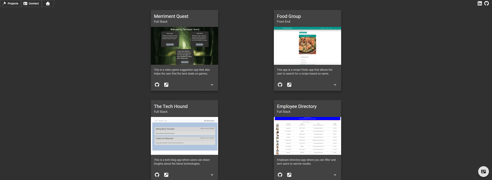

# React Portfolio

## Description

This is my portfolio page showcasing different projects I built and the array of technologies to go with them.

## Table of Contents

-   [Installation Instructions](#installation-instructions)
-   [Usage Information](#usage-information)
-   [License](#license)
-   [Contribution Guidelines](#contribution-guidelines)
-   [Test Instructions](#test-instructions)
-   [Questions](#questions)

## Usage Information

The links in the top left will help you navigate around the page. The project page will have a card for each project with a brief description of each. The Github logo will take you to the repository and the link icon will take you to the deployed website. Feel free to utilize the contact page to for any feedback or inquisitions.

Deployed Link: https://andrewmorrow.github.io/portfolio-react/#/

## License

This project is not utilizing a license

## Contribution Guidelines

This project is fully open source, any pull requests for improvements will be reviewed.

## Test Instructions

This app does not utilize tests

## Questions

If there are further questions please contact me with the following.

 AndrewMorrow- <a href="https://github.com/AndrewMorrow" target= "_blank">Github</a>

Email: beardedmongo@gmail.com
